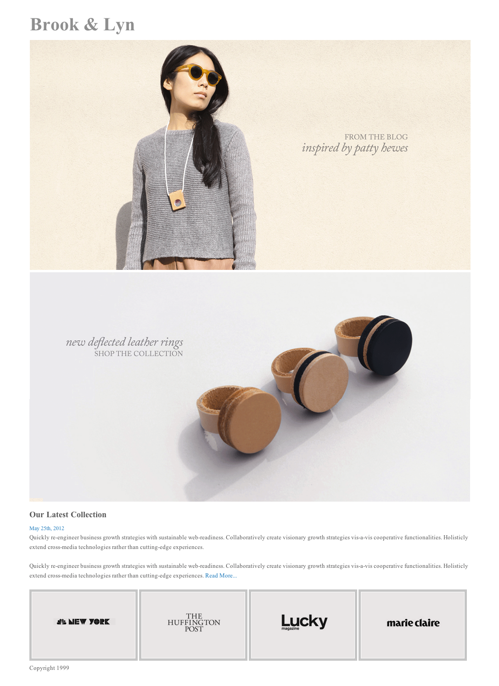

# Brook & Lyn: A layout exercise

The website of fashion brand Brook & Lyn has a simple layout. The visual elements live within a centered container, and the bottom row is laid out in the inline style.

## Exercise Objectives

- gain meaningful experience using html & css skills to build a complete layout
- gain meaningful experience centering a container div

---

## Getting Started 

1. Fork this repo and `git clone` it down to your computer.
1. When you're finished or when time is up, add, commit, and push your work to your remote repo.

```
git add .
git commit -m "YOUR MESSAGE HERE"
git push origin main
```

---

## Directions

- Use the *attached code and images* to write the html & css necessary to recreate the layout seen below.

- Add the HTML image links into your code to display all of the images in the layout (they won't be in order yet, just get them to show up on your page).

## Commit Messages
- Commit where you think it's appropriate.

## Layout


